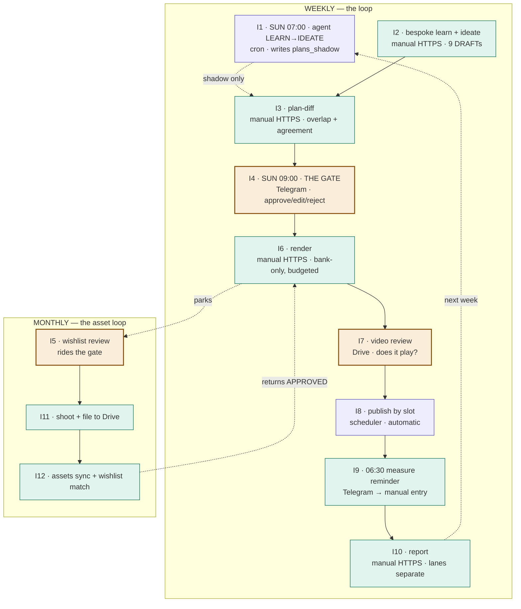

# HERMES — system state, interaction map, and gap register

**Status date:** 2026-08-03 · **Build:** v3 (commit `180842a`) · **Mode:** `plan_source = shadow`

Written as input to a planning AI. It is self-contained: it states what exists, what is
proven, where the running system diverges from the v3 architecture diagram and the v3 mega
prompt, and which decisions are still open. Nothing here is aspirational — every "verified"
claim names its evidence, and everything unproven is labelled unproven.

---

## 1. What HERMES is

A marketing loop for artec.my (Artec educational building blocks; SG + MY markets).
One Postgres store, one join key (`post_id`), four Railway services. A NousResearch
hermes-agent instance is the "Sunday brain" (learn → ideate → weekly gate); bespoke Python
is the "daily body" (toolbox, render, publish, measure, capture).

**The governing sentence:** the agent does interpretation and generation; SQL does
arithmetic; Python does pixels.

### 1.1 Topology (all four live)

| Service | Runtime | Role | State |
|---|---|---|---|
| `artec api` | FastAPI/uvicorn, NIXPACKS | capture webhooks + authenticated command routes | SUCCESS, healthy |
| `artec-scheduler` | `python -m app.scheduler` | daily publish-by-slot + 06:30 measure reminder | SUCCESS (first healthy deploy 2026-08-03) |
| `artec-brain` | hermes-agent `v2026.7.30` (0.19.1), Docker | Telegram gateway + 2 Sunday cron jobs | SUCCESS, gateway up |
| `Postgres` | Railway plugin | the only store | SUCCESS |

Config-as-code is per service (`railway.json` = artec api only, and it alone carries
`preDeployCommand: alembic upgrade head`; `railway.scheduler.json`, `railway.hermes-brain.json`
carry none). A volume at `/data/hermes` holds the brain's profile, plugins, cron, memory,
skills, sessions.

### 1.2 The seam (agent ↔ store)

`plugins/artec/` — a proper hermes-agent plugin package (`plugin.yaml`, `__init__.py` with
`register(ctx)`, `schemas.py`, `tools.py`). Six tools, handlers on the documented contract
`(args: dict, **kwargs) -> str` returning a JSON envelope always, never raising:

| Tool | Kind | Purpose |
|---|---|---|
| `read_brief` | read | v_brief (≤40 rows) + REVENUE and ENGAGEMENT as separate blocks |
| `read_learnings(week_start)` | read | SQL-computed lever scores + keep/kill/test verdicts |
| `read_asset_inventory` | read | per subject/medium counts + unused |
| `read_parked_posts` | read | PARKED posts + their asset wishlists |
| `write_plan(week_start, posts)` | write | DRAFT rows (agent mode) / `plans_shadow` (shadow mode) |
| `record_gate_decision(post_id, action, edits)` | write | approve · edit · reject · inject |

No tool writes `orders`, `events`, `metrics`, or `config`. No SQL tool. The security model
is the absence of capability, not instruction. `terminal`, `code_execution`, `file`,
`delegation`, `video`, `project`, `todo`, `kanban`, `tts`, `bfl`, `browser`, `browser-cdp`,
`computer_use`, `image_gen`, `video_gen` are disabled in the profile, and a `pre_tool_call`
hook blocks the shell/file families again.

### 1.3 Toolbox posture (v3 lockdown)

Python first: Pillow (text cards, caption bands, price badges, framing) and ffmpeg (trim,
crop-to-aspect, speed, concat, `drawtext` via `textfile=`, thumbnail, `+faststart` on every
output). One surviving model call: `fal-ai/clarity-upscaler` on real bank photographs.

Enforced, not promised: no model renders text (guard inside `Fal.run`); no generative video
(endpoints deleted from code, config and price table, repo-scan tested); bank-only for
product-depicting ideas (no `generate` tool in the routing vocabulary); GENERATE dormant and
reversible (`generate_enabled=false`); USD 1.00 per-run cap with a 50¢ per-call ceiling and
unpriced endpoints uncallable; one LoRA per call.

### 1.4 Data model

`posts` (board, log, ledger; `plan_source`, `gate_action` added in v3) · `assets` · `orders`
(money only) · `events` (behaviour only) · `metrics` (engagement only, NULL = unmeasured) ·
`learnings` · `config` · `runs` · `plans_shadow` · `agent_runs` · view `v_brief`.

### 1.5 Attribution

- **SG / Stripe:** `client_reference_id` on the hosted Payment Link is the only join key.
- **MY / Billplz:** joins on `bill_id`. `checkout.php` POSTs an `order_created` event at bill
  creation (both reference slots are occupied by discount code and pack); the paid callback
  joins against that pending row. No match → UNATTRIBUTED, never guessed.
- The spine emits `utm_campaign=post_XXXX`; artec.my reads that value.

---

## 2. Verification ledger

Evidence classes: **P** = proven in production · **A** = armed and structurally verified,
never exercised · **U** = unproven · **T** = covered by the 166-test suite only.

| Capability | Class | Evidence / note |
|---|---|---|
| Four services deploy and stay healthy | P | Railway SUCCESS on all four; `/healthz` green |
| Migrations, packaged runtime resources | P | `migrations_current: true`, `resources_packaged: true` from the running container |
| Drive asset bank (Shared Drive, 479 assets) | P | `assets sync --full`, doctor write probe |
| doctor across 15 checks | P | 14 green, 2 LoRA lines yellow-skipped by design |
| Photo render → `_generated/` → publish | P | earlier live cycle (post_1483/1484 era) |
| Billplz/MY attribution | P | real order joined via `bill_id` |
| `/event` ingestion (`order_created`) | P | live from checkout.php |
| Upload-Post photo publish | P | live post |
| Telegram gateway connects, plugin loads, 6 tools register | P | boot log: `artec plugin ENABLED`; discovery verified against a real hermes-agent install |
| Cron registration + `+08:00` resolution | P | `hermes cron list`: both jobs `[active]`, next runs `2026-08-09T07:00/09:00+08:00` |
| Anthropic key validity at brain boot | P | boot probe against `api.anthropic.com` gates the gateway start |
| Scheduler loop alive and config-resolving | P | error ticks stopped after `config seed` |
| **Agent completes a session (any tool call)** | **U** | first attempt died on a 401 (fixed); never retried |
| **Sunday crons actually firing** | **A** | first real test 2026-08-09 07:00 SGT |
| **Auto publish-by-slot firing** | **A** | needs a RENDERED post whose slot arrives |
| **06:30 measure reminder firing** | **A** | never fired |
| **Video pipeline (ffmpeg) end to end** | **T** | never run in production; post_1485 waits on it |
| **Stripe/SG attribution** | **U** | never proven with a real card |
| **Brevo send** | **U** | never sent; list-3 recipient count unknown |
| **Budget cap refusing mid-run** | **T** | caps structural; production spend never approached USD 1.00 |
| **`audit-memory` against real agent memory** | **U** | agent memory is empty |
| **Backup / restore** | **U** | never exercised; no staging environment |

---

## 3. The interaction map (updated — supersedes `hermes_human_interaction_workflow.svg`)

### 3.1 What the old diagram got wrong

The attached workflow shows a seven-box manual console pipeline
(`learn → ideate → plan-diff → artec gate → render → publish → measure`) with the agent
planning in shadow off to the side. Against the running system:

| Old diagram | Reality | Why it matters |
|---|---|---|
| `artec gate` is the gate | **The gate is the agent's Sunday 09:00 Telegram session.** The bespoke `artec gate` CLI is dormant | Both long-poll the *same* bot token; running the CLI gate while the brain is up causes a Telegram 409 and breaks the real gate |
| `artec publish` = "Console · live on platform" | **Publish is automated** daily by slot on artec-scheduler | The operator no longer publishes routinely; manual publish is an exception path |
| Everything is "Console" | Three surfaces with different reach: authenticated HTTPS `/commands/*`, Railway shell (CLI-only commands), Telegram | **10 of 21 CLI commands have no HTTP mirror** and *require* a shell |
| Loop ends at `measure` | `report` exists and is missing from the diagram | The lane-separated report is the weekly read |
| No setup/maintenance stages | `doctor`, `config seed/set/get`, `assets sync` are load-bearing | `slot_times` missing silently disabled the whole scheduler until seeded |
| No asset loop | wishlist show → shoot → sync → match is the second loop in the architecture | Parked posts never return without it |
| No failure paths | `post retry`, `post show`, park/wishlist recovery | The system parks and fails by design; recovery is operator work |
| Agent is a passive side-box | The agent **drives** two of the four scheduled jobs | In shadow it is read-only *for plans*, but it already owns the gate conversation |

### 3.2 Channels

| # | Channel | Reach | Auth |
|---|---|---|---|
| C1 | **Telegram** (one bot, held by the brain gateway) | agent gate conversation, cron output delivery, measure reminder | `TELEGRAM_ALLOWED_USERS` allowlist |
| C2 | **HTTPS `/commands/*`** on artec api | learn, ideate, assets-sync, render, publish, measure, report, plan-diff, wishlist-match, doctor | static bearer `HERMES_API_TOKEN` |
| C3 | **Railway shell** (artec api service) | everything C2 offers **plus** `config seed/set/get`, `wishlist show/fulfil`, `post retry/show`, `audit-memory`, `agent-review`, `cycle --dry-run` | Railway account |
| C4 | **Railway shell** (artec-brain) | `hermes doctor`, `hermes cron list`, `hermes plugins list`, `hermes curator`, `hermes tools --summary` | Railway account |
| C5 | **Google Drive** | asset upload (the wishlist loop), render review in `_generated/` | Drive account |
| C6 | **artec.my + card** | the spine, test purchases, attribution proof | — |
| C7 | **Railway dashboard** | env vars, deploys, volumes, logs | Railway account |

### 3.3 Interaction points — complete

Legend: **⬤ human decision required** · ○ human action, mechanical · ▷ automated, human observes

| ID | When | Trigger | Actor | Channel | What happens | State |
|---|---|---|---|---|---|---|
| **I1** | Sun 07:00 SGT | cron (brain) | agent | C1 out | LEARN→IDEATE: reads brief/learnings/inventory/parked, scouts trends, `write_plan` → `plans_shadow` | armed, never fired |
| **I2** | weekly, before the gate | manual | operator | C2 | `learn` then `ideate` (bespoke) → 9 DRAFT posts. **In shadow mode nothing schedules this** | manual, required |
| **I3** | weekly, before the gate | manual | operator | C2 | `plan-diff --week` → overlap table, per-field agreement, learning cross-references | built, unexercised |
| **I4** | Sun 09:00 SGT | cron (brain) | **⬤ operator** | C1 | **THE GATE.** Each DRAFT presented; approve · edit · reject. Rejected → fewer posts, never regenerated. Edit deltas stored in `posts.gate_action` | armed, never fired |
| **I5** | 1st Sunday monthly | rides I4 | ⬤ operator | C1 | wishlist review: parked posts + what to shoot | armed |
| **I6** | after the gate | manual | operator | C2 | `render --all-approved`: bank-only match, Pillow/ffmpeg, budget-capped; failures PARK with wishlist | manual |
| **I7** | after render, before publish | manual | **⬤ operator** | C5 | **Video review** — open `_generated/{week}/{post_id}.mp4`, confirm it plays and is on-brand | new; not in any prior plan |
| **I8** | daily at each `slot_times` entry | cron (scheduler) | ▷ none | — | publishes every RENDERED post whose slot arrived and that holds no `external_post_id` | armed, never fired |
| **I9** | daily 06:30 SGT | cron (scheduler) | ○ operator | C1 in → C2 out | reminder lists unmeasured PUBLISHED posts; operator enters figures via `measure` | armed, never fired |
| **I10** | weekly | manual | operator | C2 | `report --week`: REVENUE and ENGAGEMENT blocks, unattributed, unmeasured, parked | manual |
| **I11** | ongoing (daily-ish) | manual | ○ operator | C5 | shoot and file assets into the exact wishlist folders | the second loop |
| **I12** | after uploads | manual | operator | C2 | `assets-sync`, then `wishlist-match` → parked posts return to APPROVED | manual |
| **I13** | on failure | manual | operator | C3 | `post show`, `post retry` (refuses if `external_post_id` exists) | built |
| **I14** | on suspicion | manual | operator | C2/C4 | `artec doctor` and `hermes doctor` | routine |
| **I15** | monthly | manual | ⬤ operator | C3/C4 | `hermes curator`, `artec agent-review`, `artec audit-memory` | never run |
| **I16** | after 2–3 Sundays | **⬤ decision** | operator | C3 | flip `plan_source` shadow → agent (or stay/rollback) | pending |
| **I17** | one-time | ⬤ decision | operator | C3 | flip `allow_person_assets` once model releases are settled (unlocks 202 assets) | pending |
| **I18** | one-time | manual | operator | C3 | seed `weekly_spend_minor` to activate CAC + kill lines | pending |
| **I19** | one-time | ⬤ decision | operator | C6 | real card purchase through a live post's tracked URL → prove SG attribution | pending |
| **I20** | before first email | ⬤ decision | operator | C2 | read Brevo list-3 recipient count, decide whether to send | pending |
| **I21** | rare | manual | operator | C7 + repo | hermes-agent tag bump; re-verify toolsets and plugin discovery | documented |

### 3.4 The loop, as it actually runs

**Human decision points: three** — the gate (I4), video review (I7), wishlist review (I5).
Everything else is either mechanical operator work or automated.

---

## 4. Gap register

Severity: **S1** blocks the loop · **S2** degrades a designed capability · **S3** friction or
future risk.

### 4.A Specified in the plan, missing or broken in the build

| # | Gap | Sev | Detail | Source |
|---|---|---|---|---|
| A1 | **The gate has no tool to enumerate DRAFT posts** | **S1** | The six tools include no `read_draft_posts`. The Sunday-09:00 gate job must fish this week's drafts out of `read_brief`, whose post section is `LIMIT 14` ordered by `week_start DESC`. With 9 drafts + last week's published posts it *probably* fits — undesigned and fragile, and it breaks outright if cadence rises | mega prompt §6 vs §9 gate job |
| A2 | **`inject` is non-functional through the seam** | **S2** | `record_gate_decision(action="inject")` requires an existing `post_id`; a brand-new idea has none, so it returns `{"error": "not found"}`. The bespoke gate could create one (`_inject_idea`); the agent path cannot | v3 diagram "review · edit · reject · inject" |
| A3 | **`agent_runs` is never written** | **S2** | Table created by migration 0002, model defined, **zero INSERTs anywhere**. No observability of agent job runs, tools called, tokens, or cost | mega prompt §12 |
| A4 | **The four learning features are not explicitly enabled** | **S2** | The `learning:` config block (playbook memory, gate taste, skill creation, trend scouting) was removed when unverified keys were stripped. Behaviour is now hermes-agent defaults, not policy | mega prompt §8 |
| A5 | **Trend scouting is effectively off** | **S2** | `browser` is disabled by policy; scouting falls to `web_search`, which has no API key configured. The agent plans without trend input | v3 diagram "scouts TikTok/IG trends" |
| A6 | **No agent-side cost cap** | **S3** | The USD 1.00 cap covers fal render spend only. The weekly agent (planning + gate conversation + any scouting) has no budget guard | implied by §4 Rule 4's intent |
| A7 | **`slot` is never validated against `slot_times`** | **S1** | Ideate stores whatever the model returns; `write_plan` defaults empty to `"evening"` but validates nothing. The publish scheduler matches `Post.slot == slot` for keys in `slot_times` — **a post with an off-vocabulary slot is never published and never errors** | §9 "slot becomes a real firing time" |
| A8 | **Nothing schedules bespoke ideate in shadow mode** | **S2** | Shadow mode requires both planners to produce a plan, but only the agent's is on cron. If the operator forgets I2, plan-diff has an empty bespoke side and the comparison silently degrades | mega prompt §11 |

### 4.B Built to spec, never exercised (risk concentrated here)

| # | Item | Sev | Note |
|---|---|---|---|
| B1 | Agent session end-to-end (any tool call) | S1 | First attempt died on a 401; the fix is live but untested |
| B2 | Sunday crons firing | S1 | Registration proven; firing first testable 2026-08-09 |
| B3 | ffmpeg video pipeline in production | S1 | Only path that has never touched real footage; post_1485 blocked on it |
| B4 | Auto publish-by-slot | S1 | Also the first *unattended* publish this system will ever do |
| B5 | Brevo send | S2 | Recipient count unknown; 402-on-credits path untested |
| B6 | Stripe/SG attribution | S2 | The revenue half of one market is unproven |
| B7 | Budget refusal mid-run | S3 | Real spend never approached the cap |
| B8 | `audit-memory` on real memory | S3 | Memory is empty until the agent runs |

### 4.C Discovered in production, absent from the plan

| # | Finding | Sev | Detail |
|---|---|---|---|
| C1 | **One bot, two gate implementations** | **S1** | The brain's gateway long-polls the Telegram bot continuously. The dormant bespoke `artec gate` also long-polls `getUpdates` — running it causes a 409 and can break the live gate. Nothing in code prevents this |
| C2 | **Single-replica assumption is unguarded** | S3 | The scheduler has no lock. Two replicas would double-tick; `publish()`'s `external_post_id` guard protects the outcome but not the race |
| C3 | Measure is split across channels | S3 | Reminder arrives in Telegram; entry happens over HTTPS/shell. Deliberate (no agent tool may write metrics) but it is real friction, daily |
| C4 | Half the CLI has no HTTP mirror | S3 | 10 of 21 commands are shell-only: `config seed/set/get`, `wishlist show/fulfil`, `post retry/show`, `audit-memory`, `agent-review`, `cycle`. Every one of them is either recovery or configuration — exactly what you need when something is wrong |
| C5 | Price table is estimated, not billed | S3 | `endpoint_prices_cents` (4¢ upscale) are my estimates; never reconciled against a fal invoice |
| C6 | Toolset identifiers drift across agent versions | S3 | 0.18.x `kanban` vs 0.19.x `todo` — both disabled defensively; any tag bump needs re-verification |
| C7 | No staging; untested backups | S2 | `main` deploys straight to production; Postgres restore has never been exercised while real orders accumulate |
| C8 | Config keys are load-bearing and silently so | S2 | `slot_times` absent = scheduler dead (caught only because the tick loop logs). Same class as A7 |

### 4.D Deliberate deviations (accepted, recorded)

| # | Deviation | Rationale |
|---|---|---|
| D1 | GENERATE dormant (`generate_enabled=false`) | Operator confirmed: 479 real photographs beat synthesis. Config retained; reversible by one flip |
| D2 | All generative video removed outright | One call cost USD 8, returned non-product blocks, and produced an unplayable file |
| D3 | 202 person-assets gated off | `allow_person_assets=false` until model releases settle |
| D4 | CAC/kill lines dormant | No `weekly_spend_minor` seeded; learn reports "unmeasurable" rather than inventing a number |
| D5 | Browser beacons deferred on artec.my | Only server-side `order_created` reaches `/event` today |
| D6 | No `measure --csv` | Locked decision: figures go to the service directly |

---

## 5. Open decisions for the planner

1. **A1/A2 force a seam decision.** The gate needs draft enumeration and true idea injection.
   Options: (a) add `read_draft_posts(week_start)` and let `record_gate_decision` create a post
   when `action="inject"` — breaks "exactly six tools"; (b) widen `v_brief`'s post window and
   accept that injection happens in the next ideate; (c) keep the gate bespoke and give the
   agent only planning. The current build silently assumes (b) without saying so.
2. **Who runs bespoke ideate during shadow (A8)?** Add a third scheduled job, fold it into the
   agent's 07:00 job, or accept manual discipline and make plan-diff loudly report a missing
   side.
3. **Is trend scouting in or out (A5)?** In → provision a search API key and re-enable a
   scouting surface within policy. Out → strike it from the architecture so the diagram stops
   claiming it.
4. **Agent spend governance (A6).** Cap, meter, or accept. `agent_runs` (A3) is the natural
   home for the meter and is already schema'd.
5. **Slot vocabulary (A7).** Validate at write time (reject off-vocabulary slots), coerce to
   the nearest valid slot, or make the scheduler sweep unmatched-slot posts. Silent
   non-publication is the worst of the three.
6. **Telegram single-bot policy (C1).** Retire the bespoke gate, give it a second bot token, or
   add a runtime interlock. Leaving two long-pollers on one token is a live footgun.
7. **Cutover criteria for I16.** "2–3 Sundays of plan-diff" is a duration, not a threshold.
   Define what agreement rate, or what qualitative judgement, justifies flipping `plan_source`.
8. **Resilience baseline (C7).** Staging environment and a rehearsed restore, or an explicit
   accepted-risk decision.

---

## 6. Invariants any redesign must preserve

These are load-bearing; several were re-learned the hard way.

1. **Lane rule.** Revenue only from `orders`; engagement only from `events` + `metrics`. Never
   blended — not in SQL, not in reports, not in `read_brief`.
2. **Stale ≠ zero.** Unmeasured stays NULL and is labelled unmeasured.
3. **The model never edits money rows** — enforced by tool absence, not instruction.
4. **No model renders text.** All lettering via Pillow / ffmpeg `drawtext` with the committed
   brand fonts. Guard lives in the transport so no call site can bypass it.
5. **Video is edited, never generated**, from real `raw-video/` footage; every output carries a
   leading `moov` atom and is checked before it can leave the pipeline.
6. **Bank-only for anything depicting the product.** No match → PARK with a wishlist entry in
   the bank's folder vocabulary. There is no generation fallback.
7. **Nothing publishes without passing the gate.** Chain: scheduler selects only
   `RENDERED ∧ external_post_id IS NULL ∧ slot matches` → RENDERED requires APPROVED →
   APPROVED requires a gate decision. `publish()` independently refuses any post holding an
   `external_post_id`.
8. **A rejected slot means fewer posts.** Never regenerate a replacement.
9. **Idempotence everywhere.** Every command re-runnable; writes upsert on natural keys.
10. **Drive taxonomy is read-only**; HERMES writes only inside `_generated/`. Folder paths are
    the tag schema and must never be renamed.
11. **Rollback is one config row** (`plan_source = bespoke`), never a redeploy.
12. **Runtime resources live inside the `app` package** — the wheel ships only `app/`, and the
    deployed process imports from site-packages, not the source tree.
13. **Presence ≠ validity; exit 0 ≠ success.** Credentials are probed against their real
    endpoint at boot; registrations are verified by listing, not by return code.

---

## 7. Failure-mode history (why the invariants read the way they do)

Nine defects reached production through a green test suite. Every one was coherent, tested
code that failed only in the real environment. They cluster into three classes, and any new
design should assume the classes persist:

| Class | Instances |
|---|---|
| **Packaging / environment** — code tested from the source tree, deployed from a wheel | missing fonts; missing prompts; migrations reading from CWD |
| **Third-party contract drift** — API shape assumed rather than verified | Telegram kwarg collision; Upload-Post multipart `TypeError`; a plugin format that could never load; `cron create` rejecting `SUN` **while exiting 0** |
| **Config / credential silence** — present but wrong, or absent and unnoticed | `config seed` clobbering `seo_seeds`; a leading space in a Railway config path (service never deployed); an `ANTHROPIC_API_KEY` that passed a presence check and 401'd at first use; `slot_times` missing, disabling the scheduler |

Mitigations now in place: wheel-content inspection in CI, a repo-wide ban on parent-directory
resource walks, boot-time credential probes against real endpoints, registration verified by
listing, `/healthz` reporting `resources_packaged`, and doctor checks that go RED rather than
skipping. **A4, A7, C8 are the same class and are not yet mitigated.**
